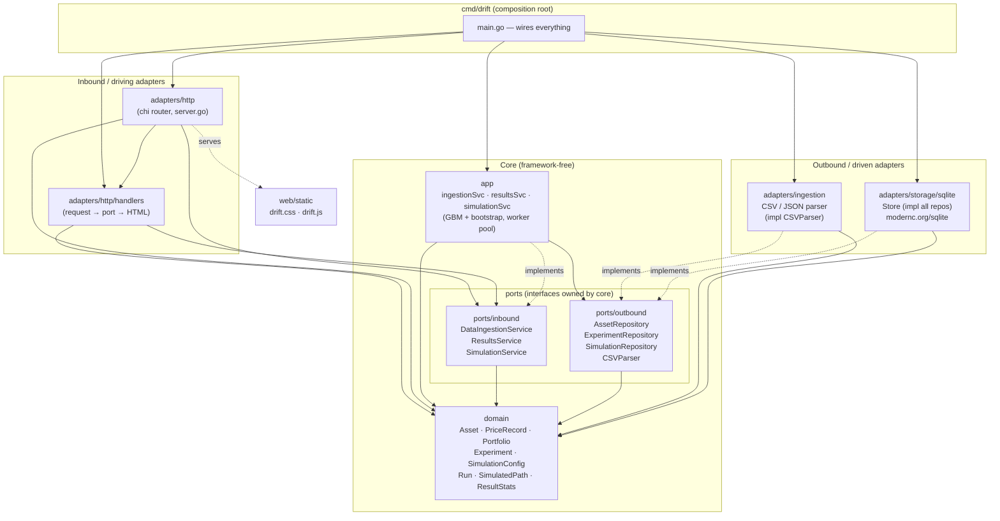

# Drift Architecture

> Detailed architecture reference for Drift. For the shorter, dated overview note see
> [`docs/architecture/2026-05-02-overview.md`](architecture/2026-05-02-overview.md). This
> document is the canonical, code-accurate description and supersedes any drift between the
> two (the older note predates the `internal/services/` → `internal/app/` rename and still
> mentions HTMX / go-sqlite3, neither of which is in the current code).

## 1. Purpose & context

Drift is a **Monte Carlo stock-portfolio simulation engine** written in Go. From historical
price data the user uploads (CSV), it estimates per-asset return distributions and runs many
forward price paths over a user-specified horizon, then aggregates them into percentile
bands, drawdown distributions, probability of loss, and CAGR statistics.

Two stochastic models are implemented in the domain/app core:

- **GBM** (Geometric Brownian Motion) — `ModelGBM`. Per-asset drift `mu` and volatility
  `sigma` are estimated from log-returns of adjusted closes (annualised with 252 trading
  days), then each daily step applies `exp((mu - 0.5·sigma²)·dt + sigma·√dt·Z)`.
- **Bootstrap / block bootstrap** — `ModelBootstrap`, `ModelBlockBootstrap`. Each daily step
  resamples an actual historical log-return per asset and combines them by portfolio weight.
  (Both identifiers currently route to the same i.i.d. resampling path; block resampling is a
  planned refinement.)

Drift ships as a **single self-hosted Go binary plus an embedded-free SQLite file** — no
external services, no CGo. The web UI is server-rendered HTML served by the same binary.

Runtime configuration (see `AGENTS.md`):

| Variable | Default | Description |
|---|---|---|
| `DRIFT_ADDR` | `:8080` | HTTP listen address |
| `DRIFT_DB` | `drift.db` | SQLite database file path |
| `DRIFT_TMPL_DIR` | (auto) | HTML template directory; auto-resolved from the source tree in dev |
| `DRIFT_STATIC_DIR` | (auto) | Static-asset directory for `/static/*` |

## 2. Architectural style

Drift follows **hexagonal architecture (ports & adapters)**. The core (domain + application)
is isolated from infrastructure. The **dependency rule is inward only**:

```
adapters  ──▶  app  ──▶  domain
   │            │
   └────────────┴──▶  ports (interfaces)  ──▶  domain
```

- `domain` depends on nothing internal (and nothing outside the Go stdlib).
- **Ports are interfaces owned by the core.** Inbound ports (`internal/ports/inbound`) are
  the API the core *exposes*; outbound ports (`internal/ports/outbound`) are the dependencies
  the core *requires*. Both reference only `domain` types.
- `app` orchestrates use cases over `domain`, depending only on `domain` and the outbound
  ports. It *implements* the inbound ports structurally (Go duck typing — no import needed).
- Adapters depend on `domain` + ports; they never import `app` and never import each other.
- `cmd/drift` is the **composition root**: it is the only place that imports concrete
  adapters and wires them into the app.

This boundary is mechanically enforced by [`.go-arch-lint.yml`](../.go-arch-lint.yml); see
[§7](#7-boundary-guard-go-arch-lint).

## 3. Component / dependency diagram



Solid arrows are compile-time import dependencies; dashed arrows are structural
("implements") relationships that carry no import.

## 4. End-to-end request / data flow

### 4.1 Ingesting price data (`POST /data/upload`)

1. Browser posts a multipart CSV to `/data/upload`.
2. `handlers.UploadCSV` reads the file part and calls the inbound port
   `DataIngestionService.IngestCSV(ctx, reader, filename)`.
3. `app.ingestionSvc` invokes the outbound `CSVParser.ParseCSV` (implemented by
   `adapters/ingestion.Parser`), producing `[]domain.PriceRecord`.
4. It upserts one `domain.Asset` per distinct symbol and then the price records via the
   outbound `AssetRepository` (implemented by the SQLite `Store`).
5. The handler re-renders the data-manager page.

### 4.2 Running a simulation (`POST /experiments/{id}/run`)

1. `handlers.RunExperiment` calls `SimulationService.RunExperiment(ctx, experimentID)`.
2. `app.simulationSvc` loads the `domain.Experiment` via `ExperimentRepository`, creates a
   `domain.Run` in `StatusRunning`, and persists it via `SimulationRepository.SaveRun`.
3. It pulls per-asset `domain.PriceRecord`s (`AssetRepository.GetPriceRecords`) for the
   configured lookback, then dispatches to `runGBM` or `runBootstrap`.
4. **Concurrency:** `workerPool` fans the requested `NumPaths` across `runtime.NumCPU()`
   goroutines. Each worker owns an independent `math/rand/v2` ChaCha8 generator seeded from a
   base seed (`SimulationConfig.Seed` when set for reproducibility, else
   `time.Now().UnixNano()`), offset per worker. Paths are collected over a buffered channel.
5. `domain.ComputeStats` reduces the `[]domain.SimulatedPath` to a `domain.ResultStats`
   (P5/P25/P50/P75/P95, mean, std dev, probability of loss, median & p95 max drawdown, median
   CAGR). The run is saved as `StatusComplete` (or `StatusFailed` with an error message).
6. The handler redirects (303) to `/runs/{id}`.

> **Synchronous today.** `RunExperiment` blocks until the simulation finishes before
> responding, despite the handler doc comment's "async" wording. Async execution is a planned
> direction — see [`docs/plans/2026-05-03-async-monte-carlo.md`](plans/2026-05-03-async-monte-carlo.md).
> Note also that `SimulationService.GetRunPaths` is a stub returning `nil` — individual paths
> are not persisted; only the aggregated `ResultStats` is stored on the `Run`.

### 4.3 Viewing results (`GET /runs/{id}`)

`handlers.RunResults` fetches the `Run` (`SimulationService.GetRun`) and its `Experiment`
(`ResultsService.GetExperiment`), then renders `results.html`. Stats are serialised to inline
JSON via the `statsJSON` template func for the client-side fan/percentile chart drawn by
`web/static/drift.js`.

### 4.4 Web UI

Server-rendered `html/template` pages under `internal/adapters/http/templates/`
(`dashboard`, `data-manager`, `experiment-builder`, `experiment-detail`, `experiments`,
`results`) share a single `layout.html`. To sidestep Go's shared `{{define}}` namespace
collision, handlers use a **clone-per-request** pattern: `layout.html` is parsed once at
startup into `baseTmpl`; each request clones it and parses only the one page template it
needs (`H.page(name)`). Static CSS/JS in `web/static/` is served under `/static/*` from a
rooted `os.DirFS` (defence-in-depth against path traversal).

## 5. Ports & adapters map

| Layer | Package | Contents | Depends on (internal) |
|---|---|---|---|
| Domain | `internal/domain` | `Asset`, `PriceRecord`, `Portfolio`/`PortfolioAsset`, `Experiment`, `SimulationConfig`, `SimulationModel`, `Run` + status consts, `SimulatedPath`, `SimulationResult`, `ResultStats`, `ComputeStats` | nothing |
| Inbound ports | `internal/ports/inbound` | `DataIngestionService`, `ResultsService`, `SimulationService` | `domain` |
| Outbound ports | `internal/ports/outbound` | `AssetRepository`, `ExperimentRepository`, `SimulationRepository`, `CSVParser` | `domain` |
| Application | `internal/app` | `ingestionSvc`, `resultsSvc`, `simulationSvc` + constructors; GBM/bootstrap math; worker pool; ID gen | `domain`, `ports/outbound` (implements `ports/inbound`) |
| Inbound adapter | `internal/adapters/http` | `New()` — chi router, middleware, routes, base-template loader | `domain`, `ports/inbound`, `.../http/handlers` |
| Inbound adapter | `internal/adapters/http/handlers` | `H` handler set: dashboard, data manager, experiments, simulations, assets | `domain`, `ports/inbound` |
| Outbound adapter | `internal/adapters/ingestion` | `Parser` (implements `CSVParser`), CSV + JSON parsing | `domain` |
| Outbound adapter | `internal/adapters/storage/sqlite` | `Store` (implements all three repositories), schema, `database/sql` + `modernc.org/sqlite` | `domain` |
| Test doubles | `internal/testdoubles` | `ServerDeps` fakes scaffold for unit tests | (none yet; permitted `domain` + ports) |
| Composition root | `cmd/drift` | `main` — env config, opens `Store`, constructs services, builds HTTP handler, `ListenAndServe` | `app`, all three adapters |

### The actual Go interfaces that serve as ports

**Inbound (driving) — what the core exposes** (`internal/ports/inbound`):

- `DataIngestionService` — `IngestCSV`, `ListAssets`, `GetAssetPrices`, `DeleteAsset`
- `ResultsService` — `CreateExperiment`, `GetExperiment`, `ListExperiments`, `ListRuns`, `GetRunStats`
- `SimulationService` — `RunExperiment`, `GetRun`, `GetRunPaths`

**Outbound (driven) — what the core requires** (`internal/ports/outbound`):

- `AssetRepository` — asset + price-record CRUD
- `ExperimentRepository` — experiment persistence
- `SimulationRepository` — run persistence
- `CSVParser` — `ParseCSV(io.Reader, filename) ([]domain.PriceRecord, error)`

Implementations: `app.ingestionSvc`/`resultsSvc`/`simulationSvc` satisfy the inbound ports;
`adapters/ingestion.Parser` satisfies `CSVParser`; a single `adapters/storage/sqlite.Store`
satisfies all three repository ports (one DB connection, `SetMaxOpenConns(1)`).

## 6. External integrations & dependencies

Verified against `go.mod`:

- **HTTP router:** `github.com/go-chi/chi/v5` (`chi.NewRouter`, `middleware.Logger`,
  `middleware.Recoverer`). No other web framework; no HTMX.
- **Storage:** `modernc.org/sqlite` — a **pure-Go, CGo-free** SQLite driver used via stdlib
  `database/sql` (no ORM). Schema applied at startup with `CREATE TABLE IF NOT EXISTS`;
  `PRAGMA journal_mode=WAL`.
- **Market-data ingestion:** user-uploaded CSV/JSON only. There is **no external market-data
  API** — nothing calls out over the network. Parsing lives in `internal/adapters/ingestion`.
- **Templating/UI:** stdlib `html/template` + hand-written `web/static/{drift.css,drift.js}`.
- Indirect deps (`google/uuid`, `dustin/go-humanize`, `mattn/go-isatty`, modernc support
  libs) are transitive.

## 7. Boundary guard (go-arch-lint)

The hexagonal boundaries are enforced in CI by
[`fe3dback/go-arch-lint`](https://github.com/fe3dback/go-arch-lint) **v1.16.0**, configured in
[`.go-arch-lint.yml`](../.go-arch-lint.yml) (`version: 3`). Components mirror the package
layout above; `deps` encode the inward rule: `domain` may depend on nothing, ports on
`domain`, `app` on `domain` + ports, adapters on `domain` + ports (never `app`, never each
other), `testdoubles` on `domain` + ports, and `cmd` on everything.

`allow.depOnAnyVendor: true` delegates third-party import policy to `go.mod`. `deepScan` is
**disabled**: with it on, go-arch-lint traces value flow through call sites and, at the
composition root (`cmd/drift/main.go`), misreads DI wiring as dependencies — e.g. a
`*sqlite.Store` passed into `app.NewSimulationService` gets flagged as `storage → app`, and
the app services passed into `httpAdapter.New` as `app → adapters/http`. Package-import
granularity is the correct level for hexagonal boundaries, so the guard checks real imports.

Run locally:

```bash
export PATH="$PATH:$(go env GOPATH)/bin"
go install github.com/fe3dback/go-arch-lint@v1.16.0
go-arch-lint check   # exits 0, "OK - No warnings found"
```

No boundary deviations exist in the current code — the guard is green with no scoped-out
rules or TODOs.

## 8. Key decisions

- **Hexagonal core with core-owned interfaces.** Ports live with the core, not the adapters,
  so infrastructure can be swapped (e.g. SQLite → Postgres) without touching `domain`/`app`.
- **Structural implementation of inbound ports.** `app` returns concrete unexported service
  types and never imports `ports/inbound`; the compiler checks satisfaction at the wiring
  site in `cmd/drift`. This keeps the app layer import-free of its own inbound API.
- **Pure-Go SQLite (`modernc.org/sqlite`).** CGo-free builds → trivial static cross-compiled
  binaries for linux/darwin × amd64/arm64.
- **No ORM.** Direct `database/sql`; single writer connection to match SQLite's model.
- **Clone-per-request templates.** Correctness over a small per-request allocation, avoiding
  the `html/template` shared-`{{define}}` collision.
- **Deterministic-capable RNG.** ChaCha8 per worker with a configurable base seed makes runs
  reproducible when `SimulationConfig.Seed` is set.
- **Error-returning ID generation.** `newID` surfaces `crypto/rand` failure as a normal error
  rather than panicking.

## 9. Deployment

There is **no Dockerfile and no homelab deployment** for Drift in this repository — verified
by inspection (no `Dockerfile*`, no image reference, no k8s/flux manifest, and no `deploy`
target in the `Makefile`). Drift is distributed as **standalone binaries**.

The release workflow [`.github/workflows/release.yml`](../.github/workflows/release.yml) fires
on `v*` tags and cross-compiles four artifacts with `-ldflags "-s -w -X main.version=<tag>"`,
attaching them to a GitHub Release:

- `drift-linux-amd64`, `drift-linux-arm64`
- `drift-darwin-amd64`, `drift-darwin-arm64`

To self-host, run a binary with `DRIFT_ADDR` / `DRIFT_DB` set (and, if the templates/static
dir is not co-located with the binary, `DRIFT_TMPL_DIR` / `DRIFT_STATIC_DIR`). The SQLite
file `drift.db` (plus `-wal`/`-shm`) is the entire persistent state and is gitignored.

## 10. Continuous integration

[`.github/workflows/ci.yml`](../.github/workflows/ci.yml) runs on pushes and PRs to `main`:
`build`, `test` (race detector), `format` (gofmt), `vet`, `lint` (golangci-lint), `tidy`
(`go mod tidy` drift check), and **`arch-lint`** — installs `go-arch-lint@v1.16.0` and runs
`go-arch-lint check` to keep the hexagonal boundaries green on every PR.
